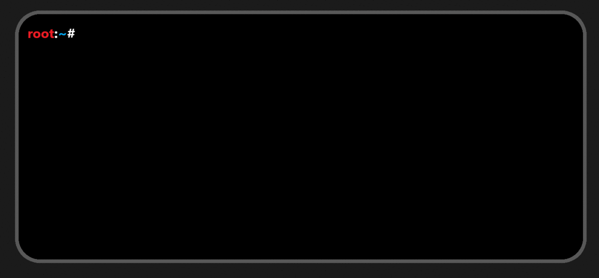

  

<h1>Hi there, I'm Vineeth!! 👋</h1>

<!--
**vinsdragonis/vinsdragonis** is a ✨ _special_ ✨ repository because its `README.md` (this file) appears on your GitHub profile.

Here are some ideas to get you started:

- 🔭 I’m currently working on ...
- 🌱 I’m currently learning ...
- 👯 I’m looking to collaborate on ...
- 🤔 I’m looking for help with ...
- 💬 Ask me about ...
- 📫 How to reach me: ...
- 😄 Pronouns: ...
- ⚡ Fun fact: ...
-->

- ***💻 I'm currently a *2nd year* Computer Science Undergraduate***
- ***🔭 I’m currently working on Web Dev projects***
- ***🤝 I'm looking forward to collaborating with developers on Web Development, Cyber Security projects***
- ***📫 How to reach me: Hit one of the links below and let's talk!!***
- ***💬 Ask me just anything! Even if I have no clue, I can always learn something new from it***

  
    
  

 

**⚡ Here's a fun fact:**

  

***Contact me here:***

